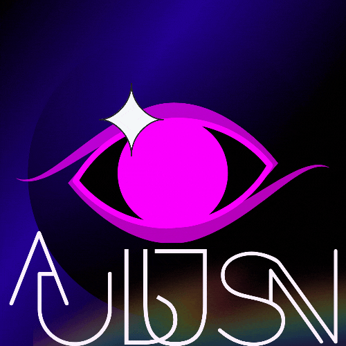
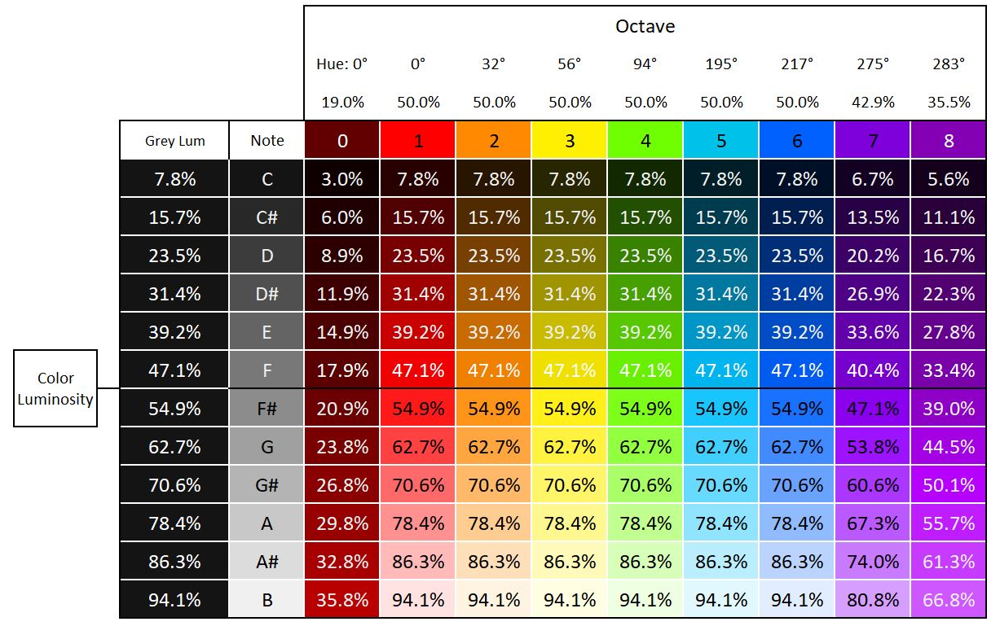
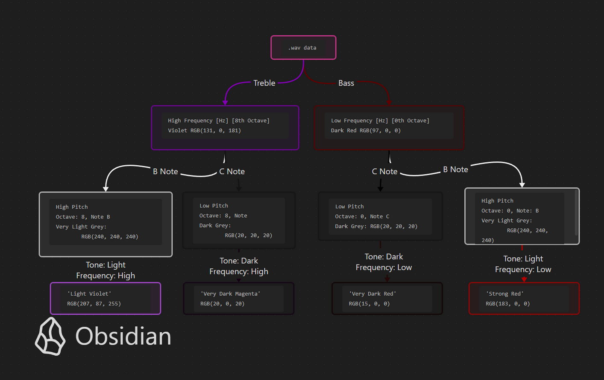

<!-- omit in toc -->
# Aurallusion



&sung; &nbsp;Aural - Illusion by Cordet Gula &nbsp; &flat;

> ' ... children's schools, when they play [out of tune] it's perfect! It's so much more colorful than a perfectly tuned orchestra. That orchestra will usually play the same 12 colors whereas the school will play maybe 60 more colors.'
>
> &nbsp;&nbsp;&nbsp;&nbsp;&nbsp;&nbsp;&nbsp;&nbsp;\- Quote from Neil Harbisson in the Interview on Hearing Colors Part 2

[[1]](https://munsell.com/color-blog/neil-harbisson-hearing-colors/)

<!-- omit in toc -->
## Table of Contents

<details>
<summary><a href="#description">1. Project Description</a></summary>

  + [Outcome](#outcome)

</details>

<details>
<summary><a href="#design">2. Design</a></summary>

+ [Project Planning](#project-planning)
+ [Dataset Model](#dataset-model)
+ [Decision Tree Model](#decision-tree-model)

</details>

[3. Languages](#languages)
 
[4. LICENSE](#license)

<!-- omit in toc -->
## Demonstration

https://github.com/user-attachments/assets/21e6cf97-6356-4b5e-9a3f-00b679fd664c

<!-- omit in toc -->
## Description

Aurallusion is an audio visualization tool that incorporates multiple functionalites. In effort to use different components of sound data, the program has implemented methods to extract and evaluate audio data, such as pitch. Foundationally, Aurallusion is using frequency and pitch as audio components extracted from .wav files. The heart of aurallusion uses a decision tree machine learning algorithm to take in audio data.

In an attempt to keep the data as objective as possible, the data was used relative to absolutes on the visible light spectrum and common notes. Red has low frequency waves on the visible light spectrum and so red is associated most strongly with the bass range in octave 0 as the lowest frequency range. Violet, on the other hand, has the highest frequency on the visible light spectrum and is associated with the 8th ocatave in the treble range. The colors are measured using RGB values to allow the machine learning algorithm to make a decision from a spectrum.

To add more sound analysis, audio pitch plays a role relative to the luminous intensity of light. Note C has a low intensity pitch and is coorelated with low luminous intensity of light, whereas high luminous intensity is coorelated with the high intensity pitch of note of note B. In this project, black and white are not explicitely used but rather the lightest or darkest shade of a cooresponding color to represent the high or low pitch relative to the frequency.

---

:information_source: **Disclaimer:** While awerallusion was created with the intention of being objective by using scientific measurements and calculations, it is important to note that synesthesia experiences are highly subjective and vary depending on a synesthete's own personal perception. With chromesthesia, for example, a C note can be represent violet to one person and green to another. In addition, color naming conventions vary between different cultures and languages. 

The author does not claim the color naming schemes or the experience of chromesthesia used with awerallusion as a fact, but rather to be used with a fun tool that creates an association between sound and color and can be used to help visual thinkers learn basic music theory.

<!-- omit in toc -->
### Outcome

Once completed, Aurallusion will take an audio input and output a visual association.

<!-- omit in toc -->
## Design

<!-- omit in toc -->
### Project Planning

For the list of goals and plan for the project, see [the Docs directory](./docs).

<!-- omit in toc -->
### Dataset Model

+ Data Collection for color
+ Determining the values to use from the visible light spectrum
+ Greyscale values
+ How to calculate additional RGB to Hz values

<!--To do: don't forget to add ref-->
From the visible light spectrum, a predetermined chart was used for a value of wavelengths in nanometers and a nanometer-to-RGB calculator was used to determine the base color values. 

The visible light spectrum luminosity value represented 50% luminosity and was located at the mean Hz sound frequency between notes F and F#. 

Greyscale values represented to notes of a single octave. The greyscale was determined by a pre-set value of RGB(20, 20, 20), (40, 40, 40), ... , (240,240,240), repctively. 

The formula used for the mapping all other color data was through linear interpolation where **x = &sum; $r_i, g_i, b_i$.**

```text
Example:
max = RGB(255,255,255)

For luminsity with RGB = (20,20,20)
x = 20 + 20 + 20
x = 60
max = 255 + 255 + 255
max = 765
luminosity = 60/765 = 7.8%

For red hue = 19% at 7.8% luminosity
(7.8%/50%)*19% = 3.0% of dark red (780nm)
  where the default dark red at 100% saturation and 50% luminosity is represented as HSL (0,1,0.19)
  -- hue = 0 degrees, 1 = 100% saturation, 0.19 = 19% lightness

Note: Values are rounded to the nearest 10th.
```



<!-- omit in toc -->
### Decision Tree Model



<!-- omit in toc -->
## Languages

 

+ Python includes useful libraries for working with visual data and machine learning algorithms.
+ Rust has a great integrated module system that is useful for encapsulation and is a useful language for safe coding practices.

+ For simplicity, the program development will focus on python first and integrate rust later if possible.

<!-- omit in toc -->
## License

[](https://opensource.org/licenses/MIT)

Aurallusion is licensed under the MIT License. See [LICENSE](./LICENSE) for more information.

---

[Back to Top](#aurallusion)
